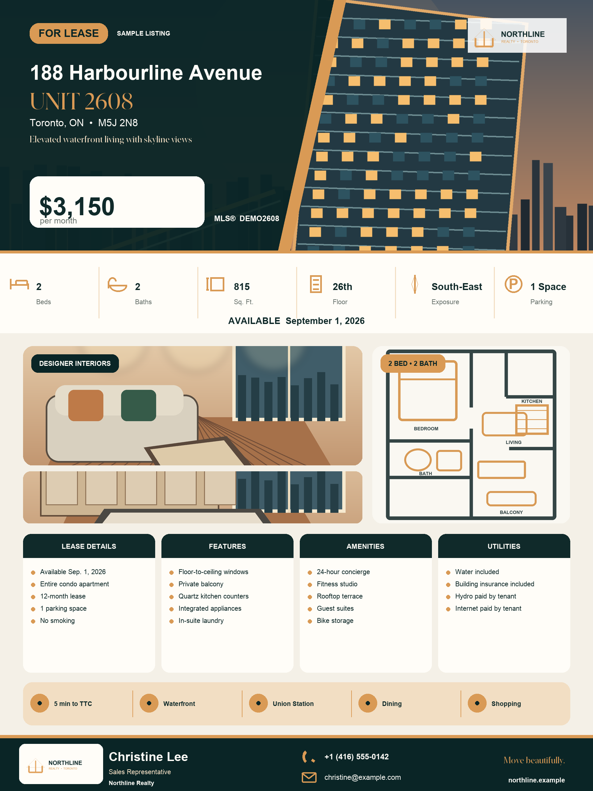

# Realtor Poster Generator · 房地产海报生成器

[](https://github.com/xudaniel/realtor-poster-generator/actions/workflows/ci.yml)
[](LICENSE)
[](web/)

Created and maintained by **Daniel Xu**. 由 **Daniel Xu** 创建并维护。

[中文 README](README.md) · [Bilingual v1.3.0 release notes](RELEASE_NOTES_v1.3.0.md) · [English PRD](PRD.en.md) · [中文产品需求文档](PRD.md) · [Live visual editor / 在线可视化编辑器](https://xudaniel.github.io/realtor-poster-generator/) · [Changelog](CHANGELOG.md) · [Contributing](CONTRIBUTING.md)

Current version: **1.3.0**

Realtor Poster Generator is a reusable, structured-data-driven toolkit for real-estate sale and rental artwork. Its information hierarchy includes a prominent listing status, address and price, property facts, interior photography, an optional floor plan, detail sections, neighbourhood highlights, and agent contact information. The composition, typography, colours, shapes, and layout are original rather than a pixel-for-pixel copy of any reference design.

The Python workflow uses Pillow and the browser workflow uses Canvas. Both render every address, price, MLS® number, contact detail, and property description deterministically from validated YAML, JSON, or form data. No generative model rewrites listing text, preventing AI-created spelling errors in addresses, telephone numbers, and prices.

<p align="center">
  
</p>

## No-install browser editor

Open the [live editor](https://xudaniel.github.io/realtor-poster-generator/) for a no-install visual campaign workflow:

1. Enter complete listing, agent, brand, and English/Chinese campaign content.
2. Add a hero, four ordered interior photos, a floor plan, and light/dark logo variants, then control the hero crop.
3. Select a lease, sale, open-house, or just-listed compliance profile and clear its export preflight.
4. Save versioned templates with selectively locked brand fields and switch among English, Chinese, and bilingual artwork.
5. Preview five formats, download PNG, print to PDF, or export a social ZIP, SHA-256 manifest, and complete approval package.

Photos, contact details, and project files remain in the current browser tab and are not uploaded to a server. The editor contains no analytics code. It can also run entirely on your computer:

```bash
python3 scripts/serve_web.py
```

Then open `http://127.0.0.1:8765`. Browser projects can be saved as JSON or YAML and preserve the form, theme, focal point, images, template, compliance profile, and review record. Approval packages include five proofs, source data, the review record, a manifest, and checksums; they record workflow status but do not constitute legal or brokerage approval.

## Features

- Address, unit, rent or price, MLS®, bedrooms, bathrooms, area, floor, exposure, parking, and availability
- Property features, building amenities, utilities, lease terms, and neighbourhood highlights
- Hero image, up to four interior images, optional floor plan, and transparent brand logo
- EXIF orientation, proportional scaling, crop control, and hero-image focal point
- Automatic font reduction, wrapping, and list limits to prevent overflow
- Required-field, email, phone, numeric, colour, and asset-path validation
- Configurable brand colours, fonts, canvas size, and output resolution
- PNG, single-page PDF, and a provenance manifest with SHA-256 hashes
- Interactive listing questionnaire and editable YAML template
- Folder-wide batch processing for YAML, YML, and JSON listings
- Square, portrait, story, and landscape social-media layouts
- Offline hero-focal and full-poster preview page
- Pixel-determinism tests, quantitative visual-difference metrics, and optional diff images
- Complete browser fields, interior photos, floor plans, dual logos, and YAML/JSON interchange
- Lease, sale, open-house, and just-listed compliance profiles with agent title/licence data and blocking export preflight
- Versioned brand templates carrying typography and a default layout, selective field locks, and independently composed English/Chinese artwork
- Approved-baseline comparison, review status, and a checksummed approval package

## Quick start

Run these commands from the project directory:

```bash
python3 -m venv .venv
source .venv/bin/activate
python -m pip install -r requirements.txt
python scripts/create_sample_assets.py
python3 generate_poster.py examples/sample_listing.yaml \
  --output outputs/sample-poster.png --pdf --social all
```

The final command creates:

- `outputs/sample-poster.png`
- `outputs/sample-poster.pdf`
- `outputs/sample-poster.square.png`, 1080 × 1080
- `outputs/sample-poster.portrait.png`, 1080 × 1350
- `outputs/sample-poster.story.png`, 1080 × 1920
- `outputs/sample-poster.landscape.png`, 1200 × 630
- `outputs/sample-poster.manifest.json`

All sample property details, images, branding, and contact information are fictional and must not be published as a real property advertisement.

## Create artwork for a real listing

### Option 1: interactive questionnaire

An agent can answer terminal prompts instead of editing YAML manually:

```bash
python3 scripts/new_listing.py \
  --output listings/my-listing.yaml \
  --render outputs/my-listing.png \
  --pdf \
  --social all
```

The script asks for:

- Address, unit, city, postal code, and headline
- Rent or price, MLS®, bedrooms, bathrooms, area, floor, and exposure
- Parking, availability, lease terms, and utilities
- Agent name, title, phone, email, company, and website
- Hero image, interior images, floor plan, and brand-logo paths
- Property features, building amenities, and neighbourhood highlights

It saves the YAML data and can immediately generate the requested PNG, PDF, and social artwork.

### Option 2: edit the template

1. Copy `input_template.yaml`.
2. Put listing photos, the floor plan, and brand logo beside the data file, or provide correct relative paths.
3. Replace every placeholder.
4. Validate the data first:

```bash
python3 generate_poster.py my-listing.yaml --validate-only
```

5. Generate PNG and PDF files:

```bash
python3 generate_poster.py my-listing.yaml \
  --output outputs/my-listing.png --pdf
```

The package can also be installed as a local command:

```bash
python -m pip install -e .
realtor-poster my-listing.yaml -o outputs/my-listing.png --pdf
```

## Batch generation

Place multiple YAML, YML, or JSON listings in a folder such as `listings/`, then pass the folder as the input:

```bash
python3 generate_poster.py listings/ \
  --output outputs/batch \
  --pdf \
  --social all
```

Every listing is validated before rendering starts. If any input is invalid, no output directory is created, avoiding half-complete campaign packages. After all inputs pass, each listing receives its own PNG, optional PDF, social artwork, and manifest. The batch result is recorded in:

```text
outputs/batch/batch-summary.json
```

Validate the entire folder without generating images:

```bash
python3 generate_poster.py listings/ --validate-only
```

Hidden directories, generated manifests, and batch summaries are excluded from discovery.

## Social-media formats

Use `--social` to choose formats:

```bash
# Generate all four formats
python3 generate_poster.py my-listing.yaml -o outputs/my-listing.png --social all

# Generate only square and story formats
python3 generate_poster.py my-listing.yaml -o outputs/my-listing.png \
  --social square --social story
```

| Option | Dimensions | Typical use |
|---|---:|---|
| `square` | 1080 × 1080 | Instagram and Facebook square posts |
| `portrait` | 1080 × 1350 | Instagram portrait posts |
| `story` | 1080 × 1920 | Instagram and Facebook stories |
| `landscape` | 1200 × 630 | Facebook, LinkedIn, and link previews |

Social outputs use the same validated listing facts and brand theme as the complete poster, but use responsive, mobile-readable layouts rather than stretching or compressing the full poster.

## Hero focal-point preview

When automatic cropping does not preserve the important building, room, or view, create a self-contained preview page:

```bash
python3 scripts/focal_preview.py examples/sample_listing.yaml \
  --output outputs/sample-focal-preview.html
```

Open the generated HTML, click the important point on the full image, and inspect the banner crop immediately. The page provides copyable YAML:

```yaml
hero_focal: [0.620, 0.480]
```

All images are embedded in one HTML file. The preview does not upload listing photographs to an external website.

## Visual-regression checks

After changing brand colours, fonts, or rendering code, compare a candidate image with an approved baseline:

```bash
python3 scripts/visual_regression.py \
  approved/sample-poster.png \
  outputs/sample-poster.png \
  --diff outputs/sample-poster.diff.png \
  --threshold 0.004
```

The command reports:

- Whether the image passed the threshold
- Normalized mean absolute error
- The proportion of visibly changed pixels
- Maximum colour-channel difference

Identical artwork returns success. A difference above the threshold returns a non-zero status so automated checks can stop unexpected layout changes. A diff image is for review only and must not be published as listing artwork.

## Input fields

The template supports:

- Listing status, address, unit, city, postal code, and headline
- Rent or price, billing period, and MLS® number
- Bedrooms, bathrooms, area, floor, exposure, parking, and availability
- Lease terms, property features, building amenities, utilities, and neighbourhood highlights
- Agent name, title, phone, email, company, website, and brand tagline
- Hero image, up to four interior images, floor plan, and brand logo
- Brand colours, optional fonts, canvas dimensions, and DPI

All required fields and asset paths are checked before rendering. Email addresses must use a common valid format. Phone numbers must contain 10 to 15 digits and may include typical spaces, parentheses, plus signs, and hyphens.

Area can be a positive number such as `815` or an ASCII-hyphen range such as `600-699`.

## Photo cropping

The renderer reads EXIF orientation, scales proportionally, and crops without stretching.

Set the important area with `hero_focal: [x, y]`. Both values range from `0` to `1`:

- `[0.0, 0.0]`: prioritize the top-left corner
- `[0.5, 0.5]`: prioritize the centre
- `[1.0, 1.0]`: prioritize the bottom-right corner

A hero image should preferably be at least 2,000 pixels wide, interior images at least 1,400 pixels wide, and a floor plan should have clear black-and-white contrast. A transparent PNG is recommended for the brand logo.

## Branding and fonts

Edit the seven hexadecimal colours under `theme` in YAML to match a brokerage or team brand.

`font_regular`, `font_bold`, and `font_serif` may point to `.ttf`, `.otf`, or compatible font collections. When left blank, the renderer selects common system fonts on macOS or Linux.

For consistent output across computers, pin Python and Pillow versions and use the same explicit font and image files. The manifest records SHA-256 hashes for the input file, images, fonts, and generated output.

## JSON input

YAML is convenient for manual entry, but structurally equivalent JSON is also supported:

```bash
python3 generate_poster.py listing.json \
  --output outputs/listing.png --pdf
```

## Project structure

```text
generate_poster.py                  Simple poster-generation entry point
realtor_poster/                     Rendering, drawing, validation, and CLI modules
realtor_poster/batch.py             Batch discovery, preflight, and summaries
realtor_poster/social.py            Four responsive social-media layouts
realtor_poster/preview.py           Offline hero-focal and layout preview
realtor_poster/visual_regression.py Visual-difference metrics and diff images
web/                                Complete browser-local campaign editor with no uploads
web/core.js                         Project schema, validation, YAML, manifests, and comparison
scripts/new_listing.py              Interactive agent questionnaire
scripts/create_sample_assets.py     Fictional sample-asset generator
scripts/serve_web.py                Local browser-editor server
scripts/focal_preview.py            Focal-preview entry point
scripts/visual_regression.py        Visual-regression entry point
examples/sample_listing.yaml        Sample listing data
examples/assets/                    Fictional sample images and logo
input_template.yaml                 Copyable listing-data template
tests/test_poster.py                Python and static browser tests
tests/test_web_core.js              Browser-core unit tests
outputs/                            Generated artwork and manifests
PRD.md                              中文产品需求文档
PRD.en.md                           English product requirements document
```

## Tests

```bash
python scripts/create_sample_assets.py
python -m unittest discover -s tests -v
node --check web/app.js
node tests/test_web_core.js
```

Coverage includes:

- Sample validation and 1800 × 2400 poster rendering
- Clear errors for invalid email addresses and phone numbers
- Single-value and range-based area input
- Four social output dimensions and RGB modes
- Pixel determinism for repeated rendering in one environment
- Embedded imagery and privacy boundaries in the offline focal page
- Detection of meaningful visual changes
- Multi-listing discovery, preflight validation, and batch output
- Browser-editor privacy boundaries, export functions, and core assets
- Browser YAML round-trips, compliance gates, template manifests, approval requirements, and project comparison
- Multi-version Python CI, JavaScript syntax, sample rendering, and package builds

## Pre-publication checklist

Before publishing real listing artwork, the responsible agent or brokerage must verify:

- The address, price, MLS®, area, and every advertising claim are accurate
- The listing photos, floor plan, logo, and fonts are licensed for the intended use
- The advertisement follows applicable real-estate regulations and brokerage rules
- Required disclaimers, registered brokerage name, and agent identity information are complete

This project supplies layout and technical validation. It does not replace final factual, compliance, brokerage, or legal review.

## License and author

Copyright © 2026 **Daniel Xu**. Released under the [MIT License](LICENSE). Read [CONTRIBUTING.md](CONTRIBUTING.md) before opening an issue or pull request.
